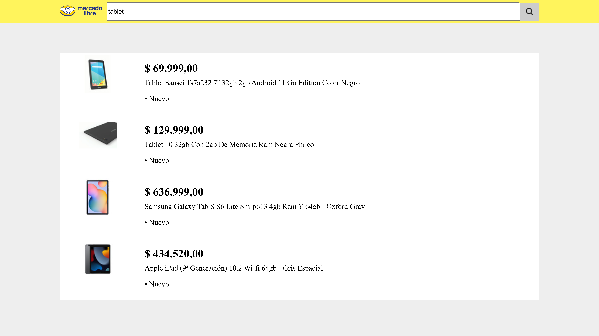
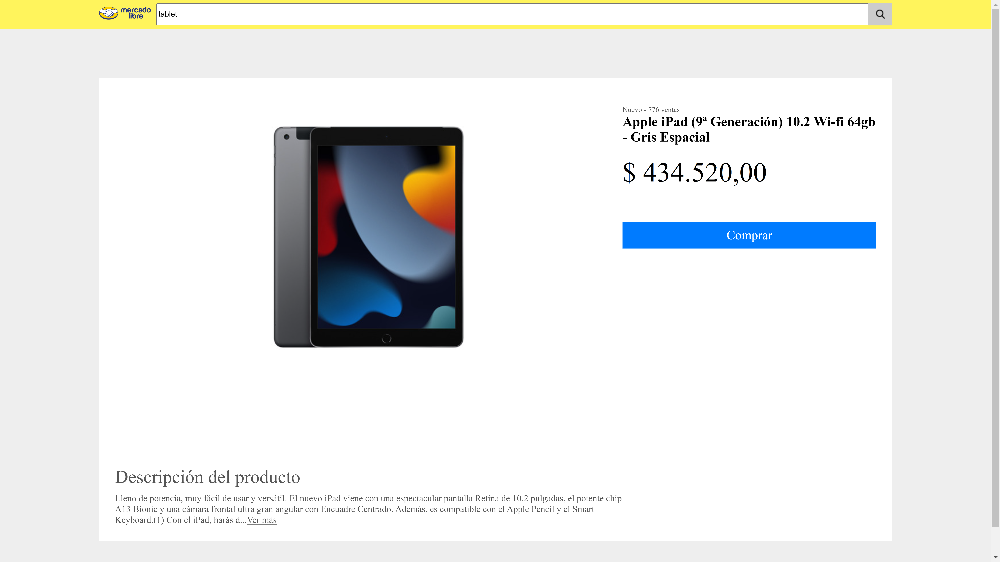

# Práctica - Test de Frontend de MercadoLibre

Este proyecto es una solución desarrollada como respuesta a un test de frontend propuesto por MercadoLibre, que encontré por Internet. La solución ha sido diseñada para poner en práctica y fortalecer los conocimientos de desarrollo tanto en el frontend como en el backend, además de aprender a consultar APIs externas, en este caso, una API de MercadoLibre.

## Tecnologías Utilizadas

- **Node.js**: Para el desarrollo del servidor en el backend.
- **React**: Para crear la interfaz de usuario en el frontend.
- **JavaScript**: Lenguaje de programación principal en ambas partes del proyecto.
- **React Router DOM**: Utilizado para gestionar las rutas y la navegación en la aplicación frontend.
- **Express**: Framework de Node.js para construir la API del servidor.
- **CSS**: Para estilizar la interfaz de usuario.

## Algunas fotos




## Comandos Disponibles

- Para levantar el server, puedes utilizar el siguiente comando:

  ```bash
  cd backend
  npm run dev
  ```

- Para levantar el cliente, puedes usar el siguiente comando:

  ```bash
  cd client
  npm run dev
  ```

## Instrucciones de Uso

1. Asegúrate de que Node.js esté instalado en tu sistema.
2. Clona este repositorio en tu máquina local.
3. Abre dos terminales y navega a las carpetas 'backend' y 'client' en la raíz del proyecto.
4. Ejecuta `npm install` para instalar las dependencias tanto en el directorio del backend como en el del client.
5. Inicia la aplicación usando los comandos proporcionados anteriormente.
6. Abre un navegador web y accede a `http://localhost:5173/` para ver la aplicación.

---

*Este proyecto es una creación de Santiago Silveira.*
---
